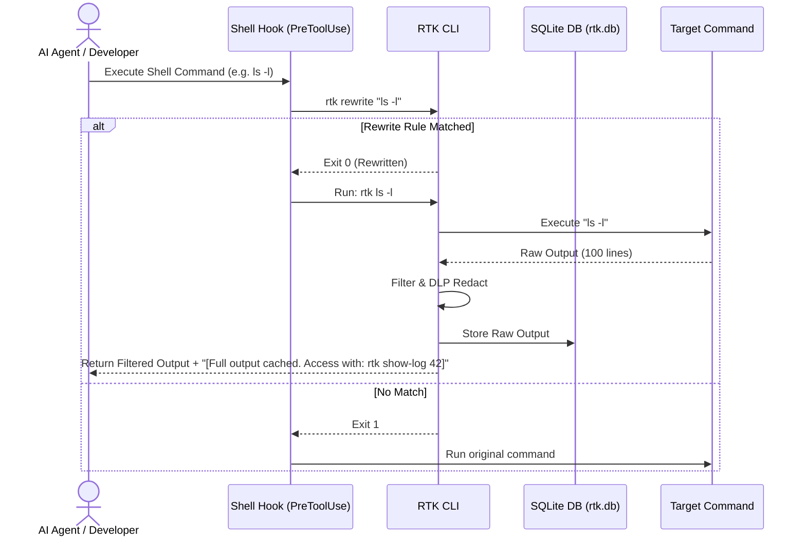
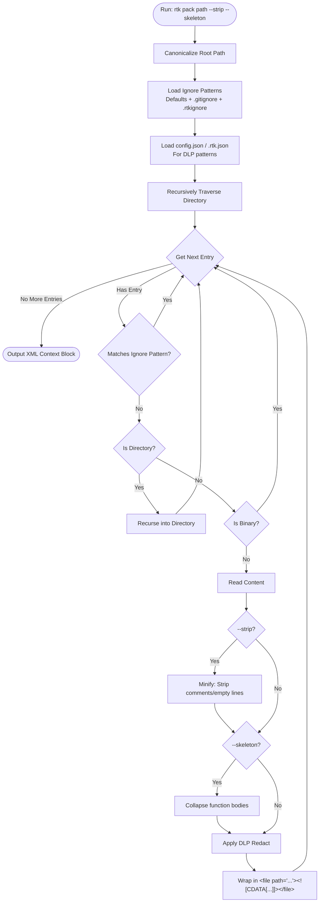

# AI Token Saver 🚀

A high-performance, token-efficient developer toolchain designed to optimize context windows, cut API costs, and improve execution speed for AI coding assistants (such as Claude Code, Cursor, Windsurf, Antigravity, and Gemini).

By filtering verbose terminal outputs, caching logs in SQLite, minifying directory text, and enforcing YAGNI developer behaviors, the toolkit saves **60% to 95% of tokens** in common coding operations.

---

## ✨ What It Does

RTK operates on two fronts: **Input Virtualization** (filtering what the AI reads) and **Output Autonomy** (instructing how the AI writes).

| Feature | Description | Tokens Saved |
| :--- | :--- | :--- |
| **Command Wrappers** | Filters standard tools (`ls`, `pytest`, `cargo`, `git`, `npm`, `dotnet`, `yarn`). Stores raw logs in SQLite FTS5; returns a hash ID. | **50% - 95%** (Input) |
| **Output Profiles** | Run `rtk init --profile <level>` to inject *Caveman* (ultra-compressed communication) & *Ponytail* rules to Cursor, Claude, Windsurf, etc. | **~75%** (Output) |
| **Context Packing** | `rtk pack . -s -k` minifies code, strips comments, and generates **tree-sitter based** function skeletons into XML. | **~40%** (Input) |
| **Data Loss Prevention** | Automatically redacts API keys, credentials, and custom regex patterns from logs. | Security |
| **Semantic Memory** | `rtk memory set/get` lets AI save project notes across chat sessions in a local **SQLite FTS5 Vectorized** DB. | Time / Cost |
| **Dynamic Autonomy** | Automatic warning generation when the CLI output exceeds 3000 tokens, enforcing agent synthesis. | Cost |

### 📊 Token Savings Benchmarks

These benchmarks represent real-world savings during standard pair programming sessions measured using Anthropic's Claude 3.5 Sonnet token counting API.

| Task Profile | Standard Tokens (No RTK) | RTK Tokens | Savings (%) | Output Style |
| :--- | :--- | :--- | :--- | :--- |
| **`cargo test` (10 fails)** | ~18,500 | ~2,100 | **88.6%** | Standard |
| **`npm install` (verbose)** | ~12,400 | ~800 | **93.5%** | Standard |
| **Code Review (1 PR)** | ~3,500 | ~850 | **75.7%** | `caveman-review` |
| **Commit Generation** | ~1,200 | ~150 | **87.5%** | `caveman-commit` |
| **AI General Response** | ~800 | ~200 | **75.0%** | `caveman-full` |

**Verified Benchmarks**: ~3x faster AI generation times with 100% technical accuracy. Check your active configuration anytime with `rtk status` or view metrics with `rtk dashboard`.

---

## ⚙️ Installation & Setup

1. **Requirements**: Rust toolchain (Cargo), Bash-compatible shell.
2. **Install**:
   ```bash
   bash install.sh
   ```
3. **Initialize AI Profiles & Auto-Install** (in your workspace):
   ```bash
   rtk init --profile high
   ```
   *Note: This automatically appends RTK aliases to your `~/.bashrc`, `~/.zshrc`, and `~/.profile`.*

<details>
<summary><b>4. AI / IDE Integration (Click to expand)</b></summary>

**For Claude Code (PreToolUse Hook)**
Add this to your `settings.json` (`~/.claude/settings.json` or `%USERPROFILE%\.gemini\antigravity\settings.json`):
```json
  "hooks": {
    "PreToolUse": [
      {
        "matcher": "Bash",
        "hooks": [{ "type": "command", "command": "bash /absolute/path/to/ai-token-saver/hooks/rtk-rewrite.sh", "timeout": 5000 }]
      }
    ]
  }
```

**For Terminals (Cursor, Aider, Bash/Zsh)**
If you didn't use the auto-installer, add these aliases to your `~/.bashrc` or `~/.zshrc`:
```bash
alias git="rtk git"; alias cargo="rtk cargo"; alias pytest="rtk pytest"; alias ls="rtk ls"; alias npm="rtk npm"
```
</details>

---

## 💻 Command Reference

*   **Input Wrappers**: `rtk git status`, `rtk git diff`, `rtk git log`, `rtk cargo test`, `rtk cargo build`, `rtk pytest`, `rtk docker`, `rtk npm`, `rtk gradle`, `rtk go test`, `rtk ls`.
*   **Context Virtualization**: `rtk show-log <id>` (reads full uncompressed log), `rtk gc` (cleans old DB logs and reclaims space).
*   **Directory Packing**: `rtk pack [path] [--strip] [--skeleton] [--limit 50000]`.
*   **Project Memory**: `rtk memory set <key> <val>`, `rtk memory get <key>`, `rtk memory list`.
*   **Rules & Profiles**: `rtk init --profile <low|medium|high|max>`, `rtk sync-rules` (recursively mirrors `.cursor/rules` to subprojects).
*   **Telemetry & Status**: `rtk status`, `rtk stats`, `rtk dashboard`.

<details>
<summary><b>Personal Configuration & Guardrails (Click to expand)</b></summary>

RTK uses `~/.config/rtk/config.json` and local `.rtk.json`. 
*   **Show config**: `rtk config show`
*   **Add Guardrail**: `rtk config deny add "git push.*--force"` (Prevents AI from running this).
*   **Add DLP Regex**: `rtk config dlp add "MY_API_KEY_[0-9a-zA-Z]{32}"` (Redacts custom secrets).
</details>

<details>
<summary><b>Architecture & Workflow (Click to expand)</b></summary>



**Context Directory Packaging (`rtk pack`)**

</details>

---

## 🤖 AI Agent Guide (Readiness & Instructions)

> [!NOTE]
> This section is specifically written for AI Coding Assistants to read and follow. If you are an AI agent, you MUST follow these guidelines.

1. **Intercepted Commands**: Running standard tools (e.g., `pytest`, `cargo test`) yields filtered outputs. If a log is truncated, a cache note appears. **DO NOT re-run the command** to view failures; instead, run `rtk show-log <id>` to retrieve the raw database record.
2. **Context Packaging**: DO NOT execute `cat` on many files. Use `rtk pack . --strip` to read directories. Pass `--limit <max_tokens>` to prevent overflows.
3. **Long-Term State Memory**: Use `rtk memory set/get` to save project-specific settings (like open ports, DB URLs, architecture decisions) across chat sessions.
4. **Behavioral Rules**: RTK enforces *Ponytail* and *Caveman* styles. Implement the minimal amount of code possible. **DO NOT write boilerplate, unrequested features, or restructure folders.** Keep diffs extremely narrow.

---

## 📄 License
Licensed under the **Apache License 2.0**.
