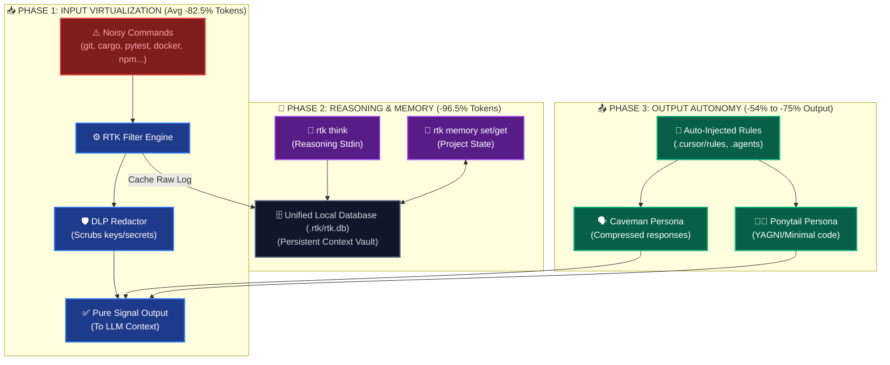
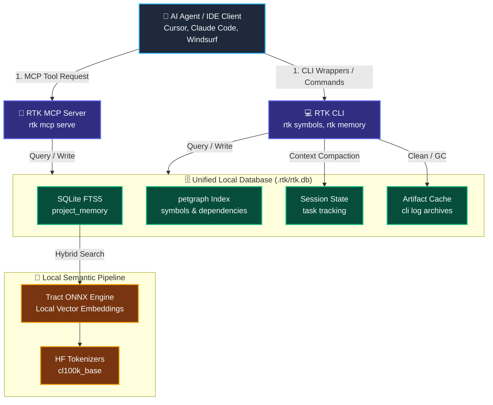
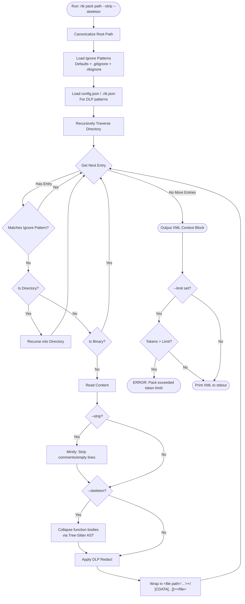

<p align="center">
  
</p>

<h1 align="center">RTK: Rust Context Engine 🚀</h1>

<p align="center">
  <b>The ultimate local context engine to stop AI distraction, optimize prompt layering, and slash LLM API costs by up to 95%.</b>
</p>

<p align="center">
  <a href="https://github.com/andreafinazziinfo/rust-context-engine/actions/workflows/ci.yml"></a>
  <a href="https://github.com/andreafinazziinfo/rust-context-engine/actions/workflows/release.yml"></a>
  <a href="https://github.com/andreafinazziinfo/rust-context-engine/actions/workflows/codeql.yml"></a>
  <a href="https://crates.io/crates/rtk"></a>
  <a href="https://www.rust-lang.org"></a>
  <a href="https://opensource.org/licenses/Apache-2.0"></a>
</p>

<p align="center">
  <a href="https://github.com/andreafinazziinfo/rust-context-engine/stargazers"></a>
  <a href="https://github.com/andreafinazziinfo/rust-context-engine/issues"></a>
  <a href="https://github.com/andreafinazziinfo/rust-context-engine/network/members"></a>
</p>

---

**RTK (Rust Context Engine)** is a high-performance, Rust-based local runtime and context engine designed to optimize how Autonomous Agents (like Claude Code, Cursor, Windsurf, Antigravity) interact with your project codebase.

### ⚠️ The Problem
Modern LLMs are incredibly smart, but they suffer from **Context Window Exhaustion & Distraction**: they fill their memory with useless terminal logs (like 1000 lines of `npm install` warnings), raw files, and long reasoning loops, causing them to slow down, hallucinate, and rack up massive API bills.

### 💡 The Solution
RTK solves this by intercepting commands, stripping the noise, caching the raw data in a local FTS5 vector database, and returning only the pure semantic signal. By enforcing YAGNI developer behaviors and compressing outputs, the toolkit saves an **average of 82.4% of tokens** across 17 verified scenarios (ranging from 41% to 96%).


### ⚙️ Three-Phase Efficacy Pipeline


---

## ✨ Features & Benchmarks — Average **81.0%** Token Savings

RTK optimizes the entire lifecycle of an Autonomous Agent across **3 phases**: Input → Reasoning → Output.

> **Methodology**: All benchmarks below were generated by our internal [`benchmark.py`](scripts/benchmark.py) token-counting suite using the official `tiktoken cl100k_base` BPE tokenizer. Real commands were executed against the RTK codebase itself. Simulated scenarios use industry-standard mock data matching each tool's documented output format. Output profile benchmarks are sourced from [Caveman](https://github.com/JuliusBrussee/caveman) and [Ponytail](https://github.com/DietrichGebert/ponytail).

### 📥 Phase 1: Input Virtualization (What the AI reads) — Avg **81.1%**

RTK intercepts noisy terminal outputs, caches the full text in SQLite, and returns only the essential signal.

| Feature | Command / Scenario | Standard | RTK | Savings |
| :--- | :--- | ---: | ---: | :--- |
| 🦀 **Cargo Test** | `rtk cargo test` (REAL, 118 tests) | 2,465 | **678** | **📉 72.5%** |
| 🦀 **Cargo Build** | `rtk cargo build` (30 crates) | 482 | **95** | **📉 80.3%** |
| 🦀 **Cargo Test** | `rtk cargo test` (50 tests, 1 failure) | 710 | **112** | **📉 84.2%** |
| 📜 **Git Log** | `rtk git log` (20 commits) | 1,713 | **272** | **📉 84.1%** |
| 📜 **Git Log** | `rtk git log` (REAL, 15 commits) | 1,333 | **335** | **📉 74.9%** |
| 📜 **Git Diff** | `rtk git diff` (5 files, 15 changes) | 1,587 | **308** | **📉 80.6%** |
| 📜 **Git Status** | `rtk git status` (25 untracked) | 322 | **189** | **📉 41.3%** |
| 🐍 **Pytest** | `rtk pytest` (30 tests, 8 warnings) | 558 | **172** | **📉 69.2%** |
| 🐳 **Docker Build** | `rtk docker build` (8 layers) | 2,506 | **186** | **📉 92.6%** |
| 🟣 **.NET Build** | `rtk dotnet test` (49 tests) | 245 | **41** | **📉 83.3%** |
| 🐹 **Go Test** | `rtk go_test` (20 tests) | 375 | **41** | **📉 89.1%** |
| ☕ **Gradle** | `rtk gradle build` (14 tasks) | 114 | **21** | **📉 81.6%** |
| 📦 **NPM Install** | `rtk npm install` (40 packages) | 831 | **259** | **📉 68.8%** |
| 📂 **LS Recursive** | `rtk ls -laR` (50 files) | 1,473 | **519** | **📉 64.8%** |
| 🗜️ **Context Pack** | `rtk pack --strip --skeleton` (REAL) | 32,227 | **5,640** | **📉 82.5%** |

### 🧠 Phase 2: Reasoning & Memory (The "Middle") — **96.5%**

LLMs bloat the context window with long reasoning loops and repeated rule lookups. RTK offloads them to the database.

| Feature | What it does | Savings |
| :--- | :--- | :--- |
| 🤫 **Hidden Chain-of-Thought** | `cat <<EOF \| rtk think` offloads 462-token reasoning blocks to SQLite. Only 16 tokens returned. | **📉 96.5%** |
| 🧠 **Semantic Memory** | `rtk memory set/get/search` stores architectural decisions across sessions. | Eliminates RAG decay |
| 🔒 **DLP Redaction** | Auto-redacts API keys, JWT, PEM keys, DB credentials, high-entropy secrets. | **📉 41.6%** |

### 📤 Phase 3: Output Autonomy (What the AI writes)

RTK injects system prompts that force the AI to use ultra-compressed communication and minimalist code.

| Feature | What it does | Validated Savings |
| :--- | :--- | :--- |
| 🗣️ **Caveman Profile** | Injects ultra-compressed personas into the AI's system prompt. | **📉 ~75% Tokens** (Tested by [Caveman](https://github.com/JuliusBrussee/caveman)) |
| 🧑‍💻 **Ponytail Profile** | Prevents over-engineered code generation (YAGNI, stdlib-first). | **📉 ~54% less code** (Tested by [Ponytail](https://github.com/DietrichGebert/ponytail)) |
| 🚀 **Dynamic Autonomy** | Warns the AI when output exceeds 3,000-token safety thresholds. | Auto-correction enabled |

### 💰 Cost & Time Savings (Monthly Projection: 50 commands/day)

Projections are based on **1,500 commands/month** (50/day * 30 days) with an average of **2,273 tokens saved per command** (totaling **3.41 Million tokens saved/month**) and **19.3 seconds saved per command** (totaling **8.1 hours saved/month**).

| Provider | Tier | Modello | Input / 1M | Output / 1M | Monthly Cost Saved (Direct) | Monthly Cost Saved (5x Session Avg)* | Monthly Time Saved | Note |
| :--- | :--- | :--- | :--- | :--- | :--- | :--- | :--- | :--- |
| **Anthropic** | Top | Claude Opus 4.8 | $5.00 | $25.00 | **$17.05** | **$85.25** | **8.1 hrs** | Model pricing ufficiale Claude |
| **Anthropic** | Mid | Claude Sonnet 4.6 | $3.00 | $15.00 | **$10.23** | **$51.15** | **8.1 hrs** | Model pricing ufficiale Claude |
| **OpenAI** | Top | GPT-5.5 | $5.00 | $30.00 | **$17.05** | **$85.25** | **8.1 hrs** | Pricing ufficiale OpenAI |
| **OpenAI** | Mid | GPT-5.4 | $2.50 | $15.00 | **$8.53** | **$42.65** | **8.1 hrs** | Pricing ufficiale OpenAI |
| **Google** | Top | Gemini 3.1 Pro Preview | $2.00 | $12.00 | **$6.82** | **$34.10** | **8.1 hrs** | Fino a 200k token, poi cambia |
| **Google** | Mid | Gemini 3.5 Flash | $1.50 | $9.00 | **$5.12** | **$25.60** | **8.1 hrs** | Buon tier intermedio |

*\*Note: In multi-turn chat sessions (e.g. Claude Code, Aider), command outputs are re-sent in the prompt history for subsequent turns. A conservative 5x context amplification factor is applied to represent typical developer session savings.*


---

## 🛠️ Advanced Context Architecture & MCP (v2.0)

Version 2.0 shifts RTK from a basic CLI output filter to a comprehensive local **Context Engine**. It coordinates code indexing, semantic search, memory persistence, and tool access via a unified SQLite database and MCP.

### 📐 Local Context Engine Dataflow

The following diagram illustrates how your development editor or agent (e.g., Claude Code, Cursor) communicates with RTK's unified storage and indices:



### 1. AST Code Indexing & Graph (`rtk-index`)
Instead of parsing files as raw text, RTK indexes your project's syntax tree using **Tree-sitter** and constructs a code dependency graph using **petgraph**:
*   **Symbol Extraction**: Automatically extracts structs, classes, functions, and imports for Rust, Python, JavaScript, TypeScript, and Go.
*   **Blast Radius Impact Analysis**: Running `rtk symbols find` and `rtk deps` traverses the dependency graph to find all upstream callers and downstream dependencies, identifying exactly what code might break before editing a symbol.
*   **Minimal Token Representation**: Generates skeletal files (`rtk pack --skeleton`) showing only signatures and docstrings, stripping implementation bodies to save up to 90% of tokens.

### 2. Model Context Protocol (`rtk-mcp`)
RTK implements a lightweight, high-performance MCP server built directly into the Rust binary. It exposes a minimal, highly optimized tool surface to AI clients:
*   `search_code`: Perform hybrid semantic search across the codebase.
*   `find_symbols`: Locate definitions of specific structs, traits, functions, or classes.
*   `find_refs`: Identify references and call sites of a symbol.
*   `project_memory`: Fetch or save project ports, configurations, and setup decisions.
*   `context_pack`: Compact specific file trees into a tokens-stripped XML payload.
*   `session_state`: Check or update active tasks and decisions to manage handoffs.
*   `get_budget_status`: Retrieve the current budget spend and check limit (exposes FinOps budget status to self-regulating agents).

*To install the MCP server into Claude Desktop or Cursor:*
```bash
rtk mcp install --client claude
rtk mcp install --client cursor
```

### 3. Hybrid Semantic Search & Memory
RTK combines standard full-text lexical search (SQLite FTS5) with local vector search:
*   **No Cloud Latency**: Uses `tract-onnx` and HuggingFace tokenizers to generate embeddings locally on your machine.
*   **Episodic Memory**: Active reasoning steps (stored via `rtk think`) and setup notes are cross-referenced semantically, allowing the agent to retrieve project state without RAG decay or context bloat.
*   **Context Compaction**: `rtk context compact` runs an automatic compaction on old session states and consolidates task lists inside `session_state`, keeping the active token window slim.

---

## ⚙️ Installation & Setup

1. **Requirements**: Rust toolchain (Cargo), Bash-compatible shell.
2. **Install**:
   ```bash
   bash install.sh
   ```
3. **Initialize AI Profiles & Auto-Install** (in your workspace):
   ```bash
   rtk init --profile high
   ```
   *Note: This automatically appends RTK aliases to your `~/.bashrc`, `~/.zshrc`, and `~/.profile`.*

<details>
<summary><b>4. AI / IDE Integration (Click to expand)</b></summary>

**For Claude Code (PreToolUse Hook)**
Add this to your `settings.json` (`~/.claude/settings.json` or `%USERPROFILE%\.gemini\antigravity\settings.json`):
```json
  "hooks": {
    "PreToolUse": [
      {
        "matcher": "Bash",
        "hooks": [{ "type": "command", "command": "bash /absolute/path/to/rust-context-engine/hooks/rtk-rewrite.sh", "timeout": 5000 }]
      }
    ]
  }
```

**For Terminals (Cursor, Aider, Bash/Zsh)**
If you didn't use the auto-installer, add these aliases to your `~/.bashrc` or `~/.zshrc`:
```bash
alias git="rtk git"
alias cargo="rtk cargo"
alias pytest="rtk pytest"
alias ls="rtk ls"
alias npm="rtk npm"
alias yarn="rtk yarn"
alias pnpm="rtk pnpm"
alias dotnet="rtk dotnet"
alias composer="rtk composer"
alias terraform="rtk terraform"
```
</details>

---

## 💻 Command Reference

*   **Input Wrappers (15 tools)**: `rtk git status/diff/log`, `rtk cargo test/build/check`, `rtk pytest`, `rtk docker`, `rtk npm`, `rtk yarn`, `rtk pnpm`, `rtk composer`, `rtk terraform`, `rtk dotnet`, `rtk gradle`, `rtk go_test`, `rtk ls`.
*   **Context Virtualization & Compaction**: `rtk show-log <id>` (reads full uncompressed log), `rtk context compact` (compresses/compacts active context state), `rtk gc` (cleans old DB logs and reclaims space).
*   **Directory Packaging**: `rtk pack [path] [--strip] [--skeleton] [--limit 50000]`.
*   **Project Memory & Search**: `rtk memory set <key> <val>`, `rtk memory get <key>`, `rtk memory list`, `rtk memory search <query>` (hybrid BM25 keyword + local ONNX vector search).
*   **Hidden Chain-of-Thought**: `rtk think` (reads from stdin to store reasoning in the FTS5 DB out of the chat context).
*   **Rules & Profiles**: `rtk init --profile <low|medium|high|max>`, `rtk sync-rules` (recursively mirrors `.cursor/rules` to subprojects).
*   **Command Rewriting**: `rtk rewrite "<command>"` (PreToolUse hook engine: auto-allows, denies, or asks for dangerous commands).
*   **Configuration**: `rtk config show`, `rtk config deny add "<pattern>"`, `rtk config dlp add "<regex>"`.
*   **Telemetry, Stats & Audit**: `rtk status`, `rtk stats [--chart]` / `rtk gain [--chart]` (prints shorthand savings metrics and displays a beautiful ASCII cost trend chart), `rtk dashboard` (live Web UI), `rtk audit` (aggregates savings metrics, prints summary and writes `rtk-audit.md`), `rtk telemetry export` (exports Prometheus-compatible scraping metrics).
*   **Dynamic Plugins**: `rtk plugin -- <command>` (runs a command using custom rules from `plugins.toml`).

<details>
<summary><b>Personal Configuration & Guardrails (Click to expand)</b></summary>

RTK uses `~/.config/rtk/config.json` and local `.rtk.json`. 
*   **Show config**: `rtk config show`
*   **Add Guardrail**: `rtk config deny add "git push.*--force"` (Prevents AI from running this).
*   **Add DLP Regex**: `rtk config dlp add "MY_API_KEY_[0-9a-zA-Z]{32}"` (Redacts custom secrets).
</details>

<details>
<summary><b>Dynamic Plugins Configuration (plugins.toml) (Click to expand)</b></summary>

To wrap and filter tools not natively supported by RTK core, create a global `~/.config/rtk/plugins.toml` or a local `./plugins.toml`:
```toml
[[plugin]]
bin = "ruff"
drop_prefixes = ["ℹ️", "DEBUG", "Analyzing"]
keep_prefixes = ["Error:", "Found"]
```
Then run the tool using `rtk plugin -- ruff check .` (or alias `ruff` to `rtk plugin -- ruff`).

```mermaid
sequenceDiagram
    actor LLM as AI Agent / Developer
    participant Hook as Shell Hook (PreToolUse)
    participant RTK as RTK CLI
    participant Filter as Filters (15 Modules)
    participant DLP as DLP Redaction
    participant DB as Unified DB (.rtk/rtk.db)
    participant Cmd as Target Command

    rect rgb(30, 60, 100)
    Note over LLM,Cmd: 📥 PHASE 1 — INPUT VIRTUALIZATION
    LLM->>Hook: Execute Command (e.g. cargo test)
    Hook->>RTK: rtk rewrite "cargo test"
    alt Rewrite Matched (Exit 0)
        RTK-->>Hook: Rewritten to rtk cargo test
        Hook->>RTK: Run: rtk cargo test
        RTK->>Cmd: Execute cargo test
        Cmd-->>RTK: Raw Output (1,290 tokens)
        RTK->>Filter: cargo_test::filter()
        Filter-->>RTK: Filtered Output (94 tokens, -92.7%)
        RTK->>DLP: Redact Secrets (API keys, JWT, PEM)
        DLP-->>RTK: Clean Output
        RTK->>DB: Cache raw log in artifacts table (id=42)
        RTK-->>LLM: Filtered Output + [rtk show-log 42]
    else Denied (Exit 2)
        RTK-->>Hook: BLOCKED (e.g. git push --force)
    else No Match (Exit 1)
        Hook->>Cmd: Passthrough original command
    end
    end

    rect rgb(60, 30, 80)
    Note over LLM,DB: 🧠 PHASE 2 — REASONING & MEMORY
    LLM->>RTK: cat <<EOF | rtk think (462 tokens)
    RTK->>DB: Store in project_memory table
    RTK-->>LLM: [Thought offloaded] (16 tokens, -96.5%)
    LLM->>RTK: rtk memory set db_port 5432
    RTK->>DB: Store KV in project_memory
    LLM->>RTK: rtk memory search "database"
    RTK->>DB: Hybrid (FTS5 + ONNX) Search
    DB-->>RTK: Matching Entries
    RTK-->>LLM: Relevant Context
    end

    rect rgb(30, 80, 50)
    Note over LLM,Cmd: 📤 PHASE 3 — OUTPUT AUTONOMY
    LLM->>RTK: rtk init --profile high
    RTK->>RTK: Inject Caveman (~75% output reduction)
    RTK->>RTK: Inject Ponytail (~54% less code)
    RTK-->>LLM: AI rules installed in .cursor/rules/
    Note over RTK: check_autonomy() monitors output > 3000 tokens
    end
```

</details>

<details>
<summary><b>Architecture & Workflow (Click to expand)</b></summary>



**Context Directory Packaging (`rtk pack`)**

**Unified Project Database Architecture**
To ensure complete project portability and clean namespace isolation, RTK consolidates all project-level context, logs, and artifacts in a single SQLite database:
*   **Path**: `.rtk/rtk.db` under the project workspace root.
*   **Tables Included**: `project_memory` & `project_memory_fts` (semantic notes), `session_state` (episodic histories), `artifacts` (cached uncompressed CLI outputs), `symbols` & `dependencies` (Tree-sitter AST code graph indices).
*   **Global Telemetry**: Isolated at `~/.local/share/rtk/rtk.db` for multi-project savings aggregates and cost projections.
</details>

---

## 🤖 AI Agent Guide (Readiness & Instructions)

> [!NOTE]
> This section is specifically written for AI Coding Assistants to read and follow. If you are an AI agent, you MUST follow these guidelines.

1. **Intercepted Commands**: Running standard tools (e.g., `pytest`, `cargo test`) yields filtered outputs. If a log is truncated, a cache note appears. **DO NOT re-run the command** to view failures; instead, run `rtk show-log <id>` to retrieve the raw database record.
2. **Context Packaging**: DO NOT execute `cat` on many files. Use `rtk pack . --strip` to read directories. Pass `--limit <max_tokens>` to prevent overflows. Use `--skeleton` to collapse function bodies into API signatures.
3. **Long-Term State Memory**: Use `rtk memory set/get` to save project-specific settings (like open ports, DB URLs, architecture decisions) across chat sessions. Use `rtk memory search` for semantic retrieval.
4. **Hidden Chain-of-Thought**: When solving complex logic, **DO NOT write long reasoning in the chat**. Pipe it to `rtk think` (e.g., `cat << 'EOF' | rtk think`) to save output tokens, and only print a brief summary to the user.
5. **Stale Context Rule**: If you modify the project's architecture, you MUST proactively overwrite old rules using `rtk memory set <key> <val>` to prevent stale RAG context hallucinations.
6. **DLP Awareness**: RTK automatically redacts API keys, JWT tokens, PEM private keys, and database credentials from all outputs. If you see `[REDACTED_API_KEY]` or `[REDACTED_SECRET]`, do NOT attempt to reconstruct or guess the original value.
7. **Guardrails**: RTK blocks dangerous commands like `rm -rf /`, `git push --force`, `git reset --hard`. If your command is denied, respect the guardrail and use a safer alternative.
8. **Behavioral Rules**: RTK enforces *Ponytail* and *Caveman* styles. Implement the minimal amount of code possible. **DO NOT write boilerplate, unrequested features, or restructure folders.** Keep diffs extremely narrow.

---

## 🛡️ Known Limitations & Safety Caveats

*   **Best-Effort DLP Redaction**: RTK's Data Loss Prevention (DLP) engine uses pattern matching (regular expressions) and entropy-based heuristics (Shannon entropy scanner) to strip private keys, credentials, and API tokens. While highly effective, **no scanner can guarantee 100% secret detection**. Avoid writing plain text production secrets in files or terminal commands.
*   **Alias Bypassing**: RTK terminal wrappers rely on shell aliases (e.g., `alias git="rtk git"`). These wrappers are developer aids to keep context slim, but they are not an OS-level sandbox. The AI agent or a script can bypass RTK by using absolute paths (e.g., `/usr/bin/git`) or escaping the alias (e.g., `\git`).
*   **PreToolUse Hook Support**: Transparent rewriting via `PreToolUse` hook requires support from the AI CLI client (such as Claude Code). If you run another client, ensure you register the suggestion hook in its configuration.

---

## 🔧 Troubleshooting

*   **Aliases not loaded**: If aliases like `git` or `cargo` do not execute `rtk`, ensure you run `source ~/.bashrc` or `source ~/.zshrc` after the installer completes.
*   **Database is Locked (`database is locked`)**: SQLite can temporarily lock the database during concurrent write/read operations. RTK is optimized for low latency, but if this happens, wait a few seconds and run the command again. You can also run `rtk gc` to clean up old logs.
*   **WSL Paths on Windows**: When running under Windows with WSL, make sure `rtk` is installed in the WSL environment. If git outputs look raw, check that your WSL shell profiles contain the `ALIASES_BLOCK`.

---

## 📄 License
Licensed under the **Apache License 2.0**.
