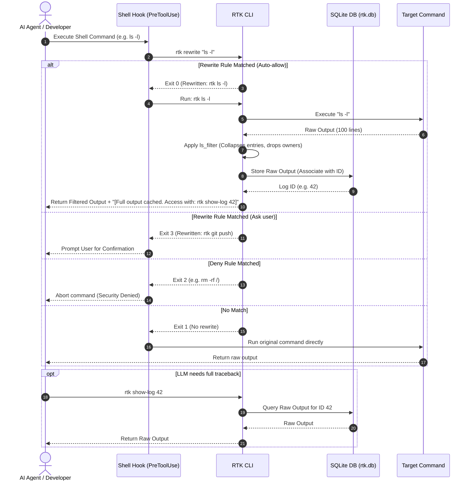

# AI Efficiency Toolkit 🚀

A high-performance, token-efficient developer toolchain designed to optimize context windows, cut API costs, and improve execution speed for AI coding assistants (such as Claude Code, Cursor, Antigravity, and other agents).

By filtering verbose terminal outputs, caching logs in SQLite, minifying directory text, and enforcing YAGNI developer behaviors, the toolkit saves **60% to 95% of tokens** in common coding operations.

---

## 📖 Table of Contents
1. [Architecture & Workflow](#-architecture--workflow)
2. [Core Features](#-core-features)
3. [Command Reference](#-command-reference)
4. [Installation & Setup](#-installation--setup)
5. [Integrating AI Rules & Prompts](#-integrating-ai-rules--prompts)
6. [License](#-license)

---

## 🏗 Architecture & Workflow

The toolkit intercepts standard developer commands using shell hooks, rewrites them to their RTK equivalents, caches full outputs, and returns compressed summaries to the AI agent.

### 1. Command Interception & Virtualization

The following sequence shows how `rtk` intercepts commands via a shell hook, checks rewrite rules, runs the command, filters output, stores the raw log in SQLite, and provides a token hash reference link back to the AI.



### 2. Context Directory Packaging & Minification

The flowchart below shows how `rtk pack` recursively scans a workspace, filters out ignored directories and binary extensions, applies comment stripping and empty line collapsing, and packages the results into a single XML context block.

```mermaid
graph TD
    Start([Run: rtk pack path --strip]) --> Canonical[Canonicalize Root Path]
    Canonical --> LoadIgnores[Load Ignore Patterns<br>Defaults + .gitignore + .rtkignore]
    LoadIgnores --> StartRecurse[Recursively Traverse Directory]
    StartRecurse --> NextEntry{Get Next Entry}
    
    NextEntry -- No More Entries --> End([Output XML Context Block])
    NextEntry -- Has Entry --> CheckIgnore{Matches Ignore Pattern?}
    
    CheckIgnore -- Yes --> Skip[Skip Entry] --> NextEntry
    CheckIgnore -- No --> IsDirectory{Is Directory?}
    
    IsDirectory -- Yes --> RecurseDir[Recurse into Directory] --> NextEntry
    IsDirectory -- No --> IsBinary{Is Binary File?}
    
    IsBinary -- Yes --> Skip
    IsBinary -- No --> ReadFile[Read File Content]
    
    ReadFile --> CheckStrip{--strip flag set?}
    CheckStrip -- Yes --> Minify[Minify Content<br>1. Strip full-line comments<br>2. Collapse consecutive empty lines] --> WrapXML
    CheckStrip -- No --> WrapXML[Wrap in XML Tag:<br>&lt;file path="..."&gt;&lt;![CDATA[...]]&gt;&lt;/file&gt;]
    
    WrapXML --> AppendOutput[Append to XML Buffer] --> NextEntry
```

---

## 🌟 Core Features

*   **Command Output Filtering**: Zero latency (sub-10ms), sub-5MB memory footprint filters written in Rust for standard commands (`ls`, `pytest`, `cargo`, `git`, `npm`).
*   **Context Virtualization**: Large logs and tracebacks are hidden from the AI context. The full raw log is saved in SQLite, and a small hash token is returned. The AI can retrieve the full log using `rtk show-log <id>`.
*   **AI-Friendly Directory Packing**: Compresses a directory structure into an XML file. Supports `.gitignore` / `.rtkignore` files and minifies code by stripping comments and blank lines.
*   **Rule Synchronization**: Recursively mirrors your system instruction files (`.cursor/rules`, `.agents/rules`) to sub-project folders so rules apply even when folders are opened individually.
*   **Token Savings Dashboard**: Command stats tracks command execution history and displays exact tokens and API costs saved.

---

## 💻 Command Reference

### 1. Transparent Command Wrappers
These commands run automatically when intercepted by shell hooks:

| Command | Action | Token Savings |
| :--- | :--- | :--- |
| `rtk git status` | Strips status help hints, untracked listing noise. | **~60%** |
| `rtk git diff` | Hides context lines, collapses changes longer than 8 lines. | **60% - 85%** |
| `rtk git log` | Condenses logs into single-line hash/subject lists. | **~70%** |
| `rtk cargo build` | Strips compilation status lines, preserving only diagnostics. | **60% - 90%** |
| `rtk cargo test` | Drops passing test lines, leaving failures and summary. | **70% - 95%** |
| `rtk pytest` | Removes platform preamble, collapses deprecation warnings. | **70% - 90%** |
| `rtk ls` | Strips group/owner, collapses directories with >20 files. | **50% - 70%** |
| `rtk npm install`| Distills NPM outputs to first/last 15 lines + error lines. | **75% - 95%** |

### 2. Toolkit Utilities

#### `rtk pack [path] [--strip]`
Searches a folder and creates an XML file representation. Use `-s` or `--strip` to remove comments and collapse blank lines:
```bash
rtk pack . --strip
```

#### `rtk show-log <id>`
Fetches the raw, uncompressed log for a virtualized command from the SQLite database:
```bash
rtk show-log 12
```

#### `rtk sync-rules`
Recursively copies instruction files from the workspace root to all subdirectory projects:
```bash
rtk sync-rules
```

#### `rtk stats`
Displays command statistics, total tokens saved, and estimated API savings:
```bash
rtk stats
```

---

## ⚙️ Installation & Setup

### 1. Requirements
*   Rust toolchain (Cargo)
*   Bash-compatible shell
*   `jq` (optional, for CLI hooks)

### 2. Build & Install
Run the installation script from the root of the repository:
```bash
bash install.sh
```
This builds the release binary and copies it into your Cargo bin path (typically `~/.cargo/bin/`). Make sure `~/.cargo/bin` is added to your environment `PATH` variable.

### 3. Claude Code Integration (PreToolUse Hook)
To activate transparent interception inside Claude Code, add the rewrite hook to your AppData configuration directory settings file:
*   **Windows**: `%USERPROFILE%\.gemini\antigravity\settings.json` or `%USERPROFILE%\.claude\settings.json`
*   **Linux/macOS**: `~/.claude/settings.json`

Add the following block to your settings:
```json
  "hooks": {
    "PreToolUse": [
      {
        "matcher": "Bash",
        "hooks": [
          {
            "type": "command",
            "command": "bash /path/to/ai-efficiency-toolkit/hooks/rtk-rewrite.sh",
            "timeout": 5000
          }
        ]
      }
    ]
  }
```
*(Replace `/path/to/` with the absolute path where you cloned the toolkit).*

### 4. Shell Integration (Zsh / Bash Aliases)
For terminal and IDE agents (such as Cursor's terminal or aider), add the following aliases to your shell config file (`~/.bashrc` or `~/.zshrc`):
```bash
# Auto-wrap commands with RTK filters
alias git="rtk git"
alias cargo="rtk cargo"
alias pytest="rtk pytest"
alias ls="rtk ls"
alias npm="rtk npm"
```

---

## 🧠 Integrating AI Rules & Prompts

The toolkit contains standard `.mdc` instruction files (system rules) located in the `/rules` directory:
1.  **`lazy-dev.mdc`**: Forces the AI agent to write minimal diffs, apply YAGNI (You Aren't Gonna Need It) code structures, and avoid writing boilerplate or documentation.
2.  **`token-efficiency.mdc`**: Instructs the AI agent to use the virtualized SQLite logs and avoid importing whole directories into Cursor context.

### Caveman Prompting
The directory `/skills/caveman/` contains a `SKILL.md` file that teaches the AI how to write replies using caveman style rules (removing helper verbs, stripping polite formatting, using compressed markdown phrases), saving up to 75% of output tokens.

---

## 📄 License

This project is licensed under the **Apache License 2.0**.
It grants patent rights from contributors to users, protecting users from patent litigation, making it safe for corporate integration and open-source contributions. See the [LICENSE](LICENSE) file for the full license text.
