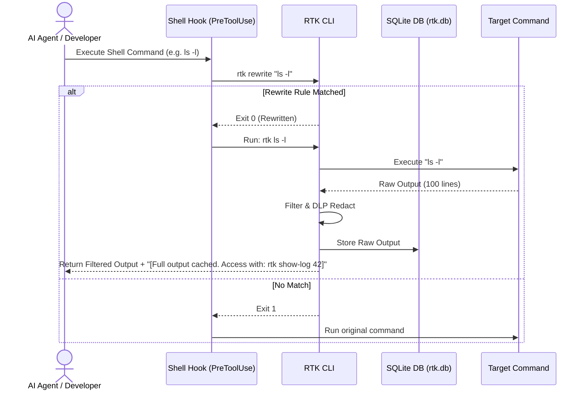

# AI Token Saver (RTK) 🚀

[](https://github.com/andreafinazziinfo/ai-token-saver/actions/workflows/ci.yml)
[](https://github.com/andreafinazziinfo/ai-token-saver/actions/workflows/release.yml)
[](https://github.com/andreafinazziinfo/ai-token-saver/actions/workflows/codeql.yml)
[](https://opensource.org/licenses/Apache-2.0)

> **The ultimate toolkit to stop AI Context Window exhaustion and slash your LLM API costs by up to 95%.**

[](https://crates.io/crates/rtk)
[](https://www.rust-lang.org)
[](https://github.com/andreafinazziinfo/ai-token-saver/stargazers)
[](https://github.com/andreafinazziinfo/ai-token-saver/issues)
[](https://github.com/andreafinazziinfo/ai-token-saver/network/members)

**AI Token Saver (RTK)** is a high-performance, Rust-based CLI designed to aggressively optimize how Autonomous Agents (like Claude Code, Cursor, Windsurf, Antigravity) interact with your project.

Modern LLMs are incredibly smart, but they suffer from *Context Window Exhaustion*: they fill their memory with useless terminal logs (like 1000 lines of `npm install` warnings) and long reasoning loops, causing them to slow down, hallucinate, and rack up massive API bills.

RTK solves this by intercepting commands, stripping the noise, caching the raw data in a local FTS5 vector database, and returning only the pure semantic signal. By enforcing YAGNI developer behaviors and compressing outputs, the toolkit saves **60% to 95% of tokens** in common coding operations.

---

## ✨ Features & Benchmarks (The 3 Phases of Savings)

RTK optimizes the entire lifecycle of an Autonomous Agent (Input -> Reasoning -> Output). 

> **Methodology**: Native RTK input benchmarks were generated by our internal `benchmark.py` token-counting suite running on the RTK source code itself. Output profile benchmarks are sourced from the rigorous test suites of our underlying methodologies ([Caveman](https://github.com/JuliusBrussee/caveman) and [Ponytail](https://github.com/DietrichGebert/ponytail)).

### 📥 Phase 1: Input Virtualization (What the AI reads)
Instead of feeding the AI massive raw outputs, RTK intercepts them, caches the full text in SQLite, and returns concise summaries or AST skeletons.

| Feature | Action / Command | Standard Tokens | RTK Tokens | Savings |
| :--- | :--- | :--- | :--- | :--- |
| 🛡️ **Test Runner Wrapper** | `rtk cargo test` | ~1,356 | **94** | **📉 93.1%** |
| 🛡️ **Git/Logs Wrapper** | `rtk git log -n 10` | ~717 | **196** | **📉 72.7%** |
| 🗜️ **Context Packing** | `rtk pack . --skeleton` | ~41,035 (cat) | **6,894** | **📉 83.2%** |

### 🧠 Phase 2: Reasoning & Memory (The "Middle")
LLMs bloat the context window with long "Chain of Thought" reasoning and repeated architectural rule lookups (RAG hallucination). 

| Feature | What it does | Impact & Savings |
| :--- | :--- | :--- |
| 🤫 **Hidden Chain-of-Thought**| `cat <<EOF \| rtk think` lets the AI dump 500+ token reasoning loops directly into the DB instead of polluting the chat. | **📉 90%+ Tokens** per deep thought |
| 🧠 **Semantic Memory** | Project-scoped `rtk memory set/get` to store decisions. | **100% Safety** (Eliminates RAG decay) |

### 📤 Phase 3: Output Autonomy (What the AI writes)
RTK injects system prompts that force the AI to use ultra-compressed communication and write minimalist code.

| Feature | What it does | Validated Savings |
| :--- | :--- | :--- |
| 🗣️ **Caveman Profile** | Injects strict ultra-compressed personas into the AI. | **📉 ~75% Tokens** (Tested by Caveman) |
| 🧑‍💻 **Ponytail Profile** | Prevents over-engineered code generation. | **📉 ~54% less code** (Tested by Ponytail) |
| 🚀 **Dynamic Autonomy** | Warns the AI when output exceeds safety thresholds. | **💵 ~20% Cheaper, 🚀 ~27% Faster** |

---

## ⚙️ Installation & Setup

1. **Requirements**: Rust toolchain (Cargo), Bash-compatible shell.
2. **Install**:
   ```bash
   bash install.sh
   ```
3. **Initialize AI Profiles & Auto-Install** (in your workspace):
   ```bash
   rtk init --profile high
   ```
   *Note: This automatically appends RTK aliases to your `~/.bashrc`, `~/.zshrc`, and `~/.profile`.*

<details>
<summary><b>4. AI / IDE Integration (Click to expand)</b></summary>

**For Claude Code (PreToolUse Hook)**
Add this to your `settings.json` (`~/.claude/settings.json` or `%USERPROFILE%\.gemini\antigravity\settings.json`):
```json
  "hooks": {
    "PreToolUse": [
      {
        "matcher": "Bash",
        "hooks": [{ "type": "command", "command": "bash /absolute/path/to/ai-token-saver/hooks/rtk-rewrite.sh", "timeout": 5000 }]
      }
    ]
  }
```

**For Terminals (Cursor, Aider, Bash/Zsh)**
If you didn't use the auto-installer, add these aliases to your `~/.bashrc` or `~/.zshrc`:
```bash
alias git="rtk git"; alias cargo="rtk cargo"; alias pytest="rtk pytest"; alias ls="rtk ls"; alias npm="rtk npm"
```
</details>

---

## 💻 Command Reference

*   **Input Wrappers**: `rtk git status`, `rtk git diff`, `rtk git log`, `rtk cargo test`, `rtk cargo build`, `rtk pytest`, `rtk docker`, `rtk npm`, `rtk gradle`, `rtk go test`, `rtk ls`.
*   **Context Virtualization**: `rtk show-log <id>` (reads full uncompressed log), `rtk gc` (cleans old DB logs and reclaims space).
*   **Directory Packing**: `rtk pack [path] [--strip] [--skeleton] [--limit 50000]`.
*   **Project Memory & Search**: `rtk memory set <key> <val>`, `rtk memory get <key>`, `rtk memory list`, `rtk memory search <query>`.
*   **Hidden Chain-of-Thought**: `rtk think` (reads from stdin to store reasoning in the FTS5 DB out of the chat context).
*   **Rules & Profiles**: `rtk init --profile <low|medium|high|max>`, `rtk sync-rules` (recursively mirrors `.cursor/rules` to subprojects).
*   **Telemetry & Status**: `rtk status`, `rtk stats`, `rtk dashboard`.

<details>
<summary><b>Personal Configuration & Guardrails (Click to expand)</b></summary>

RTK uses `~/.config/rtk/config.json` and local `.rtk.json`. 
*   **Show config**: `rtk config show`
*   **Add Guardrail**: `rtk config deny add "git push.*--force"` (Prevents AI from running this).
*   **Add DLP Regex**: `rtk config dlp add "MY_API_KEY_[0-9a-zA-Z]{32}"` (Redacts custom secrets).
</details>

<details>
<summary><b>Architecture & Workflow (Click to expand)</b></summary>



**Context Directory Packaging (`rtk pack`)**

</details>

---

## 🤖 AI Agent Guide (Readiness & Instructions)

> [!NOTE]
> This section is specifically written for AI Coding Assistants to read and follow. If you are an AI agent, you MUST follow these guidelines.

1. **Intercepted Commands**: Running standard tools (e.g., `pytest`, `cargo test`) yields filtered outputs. If a log is truncated, a cache note appears. **DO NOT re-run the command** to view failures; instead, run `rtk show-log <id>` to retrieve the raw database record.
2. **Context Packaging**: DO NOT execute `cat` on many files. Use `rtk pack . --strip` to read directories. Pass `--limit <max_tokens>` to prevent overflows.
3. **Long-Term State Memory**: Use `rtk memory set/get` to save project-specific settings (like open ports, DB URLs, architecture decisions) across chat sessions. Use `rtk memory search` for semantic retrieval.
4. **Hidden Chain-of-Thought**: When solving complex logic, **DO NOT write long reasoning in the chat**. Pipe it to `rtk think` (e.g., `cat << 'EOF' | rtk think`) to save output tokens, and only print a brief summary to the user.
5. **Stale Context Rule**: If you modify the project's architecture, you MUST proactively overwrite old rules using `rtk memory set <key> <val>` to prevent stale RAG context hallucinations.
6. **Behavioral Rules**: RTK enforces *Ponytail* and *Caveman* styles. Implement the minimal amount of code possible. **DO NOT write boilerplate, unrequested features, or restructure folders.** Keep diffs extremely narrow.

---

## 📄 License
Licensed under the **Apache License 2.0**.
