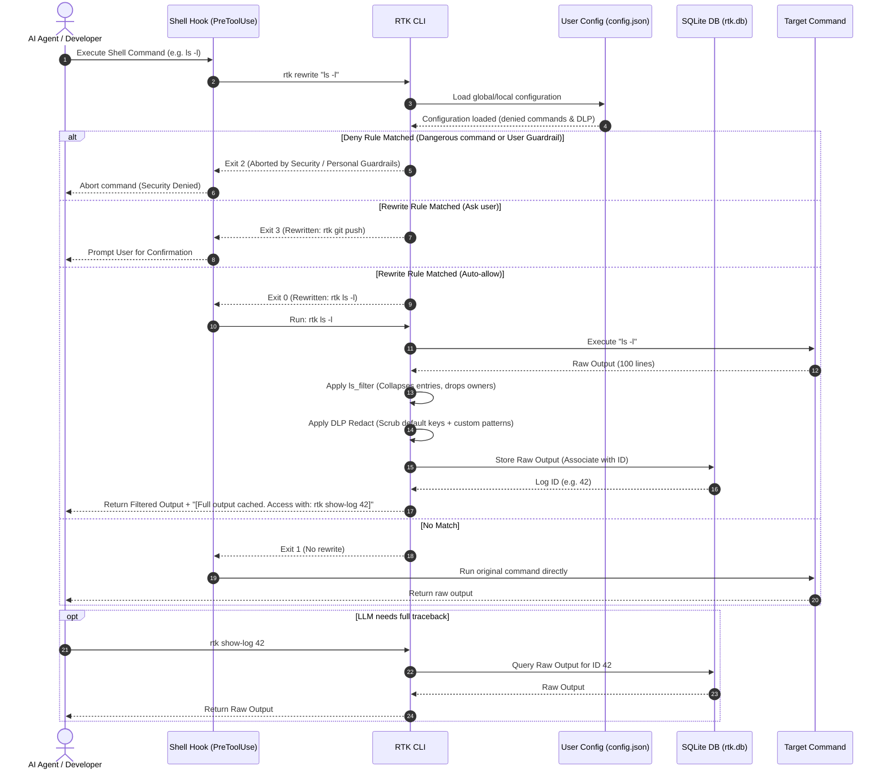
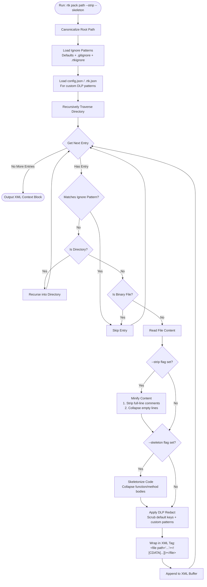

# AI Token Saver 🚀

A high-performance, token-efficient developer toolchain designed to optimize context windows, cut API costs, and improve execution speed for AI coding assistants (such as Claude Code, Cursor, Antigravity, and other agents).

By filtering verbose terminal outputs, caching logs in SQLite, minifying directory text, and enforcing YAGNI developer behaviors, the toolkit saves **60% to 95% of tokens** in common coding operations.

---

## 📖 Table of Contents
1. [Architecture & Workflow](#-architecture--workflow)
2. [Core Features](#-core-features)
3. [Command Reference](#-command-reference)
4. [Installation & Setup](#-installation--setup)
5. [Integrating AI Rules & Prompts](#-integrating-ai-rules--prompts)
6. [License](#-license)

---

## 🏗 Architecture & Workflow

The toolkit intercepts standard developer commands using shell hooks, rewrites them to their RTK equivalents, caches full outputs, and returns compressed summaries to the AI agent.

### 1. Command Interception & Virtualization

The following sequence shows how `rtk` intercepts commands via a shell hook, checks rewrite rules, runs the command, filters output, stores the raw log in SQLite, and provides a token hash reference link back to the AI.



### 2. Context Directory Packaging & Minification

The flowchart below shows how `rtk pack` recursively scans a workspace, filters out ignored directories and binary extensions, applies comment stripping and empty line collapsing, and packages the results into a single XML context block.



---

## 🌟 Core Features

*   **Command Output Filtering**: Zero latency (sub-10ms), sub-5MB memory footprint filters written in Rust for standard developer tools (`ls`, `pytest`, `cargo`, `git`, `npm`, `gradle`, `go test`, `docker`).
*   **Data Loss Prevention (DLP) Guard**: An integrated Shannon-entropy and regex-based scanner that automatically redacts API keys, credentials, JWTs, and private keys from packed context and terminal outputs before they reach the LLM.
*   **Smart Code Skeletonizer**: An indentation- and brace-based code skeletonizer (`rtk pack -k`) that strips function bodies and preserves structure for huge codebases to fit within small budgets.
*   **Context Virtualization**: Large logs and tracebacks are hidden from the AI context. The full raw log is saved in SQLite, and a small hash token is returned. The AI can retrieve the full log using `rtk show-log <id>`.
*   **AI-Friendly Directory Packing**: Compresses a directory structure into an XML file. Supports `.gitignore` / `.rtkignore` files, minifying code by stripping comments/blank lines, and compiling skeletons.
*   **Rule Synchronization**: Recursively mirrors your system instruction files (`.cursor/rules`, `.agents/rules`) to sub-project folders so rules apply even when folders are opened individually.
*   **Token Savings Dashboard**: Launch `rtk dashboard` to query the SQLite database and open a sleek, local HTML interactive report displaying tokens and estimated API costs saved.

---

## 💻 Command Reference

### 1. Transparent Command Wrappers
These commands run automatically when intercepted by shell hooks:

| Command | Action | Token Savings |
| :--- | :--- | :--- |
| `rtk git status` | Strips status help hints, untracked listing noise. | **~60%** |
| `rtk git diff` | Hides context lines, collapses changes longer than 8 lines. | **60% - 85%** |
| `rtk git log` | Condenses logs into single-line hash/subject lists. | **~70%** |
| `rtk cargo build` | Strips compilation status lines, preserving only diagnostics. | **60% - 90%** |
| `rtk cargo test` | Drops passing test lines, leaving failures and summary. | **70% - 95%** |
| `rtk pytest` | Removes platform preamble, collapses deprecation warnings. | **70% - 90%** |
| `rtk ls` | Strips group/owner, collapses directories with >20 files. | **50% - 70%** |
| `rtk npm install`| Distills NPM outputs to first/last 15 lines + error lines. | **75% - 95%** |
| `rtk gradle` | Filters task progress/executions; preserves compilation diagnostics. | **65% - 90%** |
| `rtk go test` | Hides passing test items; retains failures, panic traces, and compilation errors. | **70% - 95%** |
| `rtk docker` | Strips dynamic pull/build layer progress bars; retains build steps and warnings. | **80% - 95%** |

### 2. Toolkit Utilities

#### `rtk pack [path] [--strip] [--skeleton] [--limit <max_tokens>]`
Searches a folder and creates an XML file representation of its files. 
*   Use `-s` or `--strip` to remove comments and collapse blank lines.
*   Use `-k` or `--skeleton` to generate a skeleton structure of files, stripping function bodies for supported languages (Rust, Python, JS/TS).
*   Use `-l` or `--limit` to specify a maximum token budget (whitespace count). The command will error out if the limit is exceeded:
```bash
rtk pack . --strip --skeleton --limit 50000
```

#### `rtk memory <subcommand>`
Saves and retrieves key-value context memories isolated for the current project using the local SQLite database. This allows AI agents to write and query persistent project notes.
*   **Set a memory**: `rtk memory set <key> <value>`
*   **Get a memory**: `rtk memory get <key>`
*   **List all project memories**: `rtk memory list`
```bash
# Save project database details
rtk memory set port 5432

# Query port details
rtk memory get port

# List all memories
rtk memory list
```

#### `rtk show-log <id>`
Fetches the raw, uncompressed log for a virtualized command from the SQLite database:
```bash
rtk show-log 12
```

#### `rtk sync-rules`
Recursively copies instruction files from the workspace root to all subdirectory projects:
```bash
rtk sync-rules
```

#### `rtk stats`
Displays command statistics, total tokens saved, and estimated API savings:
```bash
rtk stats
```

#### `rtk dashboard`
Generates a sleek, local HTML telemetry dashboard and automatically opens it in the system's default browser to visualize token and cost savings with charts and tables:
```bash
rtk dashboard
```

---

## 🔒 Personal Configuration & Guardrails

RTK supports local-first configuration files that allow developers to set personal guardrails and customized DLP rules. 

### 1. Configuration File Locations
RTK reads and merges configuration parameters from two cascading locations:
1. **User Global Config**: `~/.config/rtk/config.json` (created automatically during `rtk init`).
2. **Project Local Config**: `.rtk.json` located in the root of the workspace.

*Note: Project local settings override/merge into the user's global settings.*

### 2. Configuration Options (`config.json` / `.rtk.json`)
The configuration uses a clean JSON structure:

```json
{
  "denied_commands": [
    "git push.*--force",
    "git reset --hard",
    "rm -rf /"
  ],
  "dlp": {
    "custom_patterns": [
      "MY_PROJECT_SECRET_[a-zA-Z0-9]{12}",
      "(?i)api-key-[a-z]+"
    ]
  }
}
```

*   **`denied_commands`**: A list of strings or regex patterns. If an LLM agent attempts to execute a command matching any of these patterns, RTK immediately rejects it with exit code `2` (Denied), protecting your codebase from destructive actions.
*   **`dlp.custom_patterns`**: A list of regex patterns to match project-specific tokens, credentials, or secrets. RTK will redact matches to `[REDACTED_SECRET]` before they are stored in telemetry logs or returned to the LLM agent.

---

## ⚙️ Installation & Setup

### 1. Requirements
*   Rust toolchain (Cargo)
*   Bash-compatible shell
*   `jq` (optional, for CLI hooks)

### 2. Build & Install
Run the installation script from the root of the repository:
```bash
bash install.sh
```
This builds the release binary and copies it into your Cargo bin path (typically `~/.cargo/bin/`). Make sure `~/.cargo/bin` is added to your environment `PATH` variable.

### 3. Claude Code Integration (PreToolUse Hook)
To activate transparent interception inside Claude Code, add the rewrite hook to your AppData configuration directory settings file:
*   **Windows**: `%USERPROFILE%\.gemini\antigravity\settings.json` or `%USERPROFILE%\.claude\settings.json`
*   **Linux/macOS**: `~/.claude/settings.json`

Add the following block to your settings:
```json
  "hooks": {
    "PreToolUse": [
      {
        "matcher": "Bash",
        "hooks": [
          {
            "type": "command",
            "command": "bash /path/to/ai-token-saver/hooks/rtk-rewrite.sh",
            "timeout": 5000
          }
        ]
      }
    ]
  }
```
*(Replace `/path/to/` with the absolute path where you cloned the toolkit).*

### 4. Shell Integration (Zsh / Bash Aliases)
For terminal and IDE agents (such as Cursor's terminal or aider), add the following aliases to your shell config file (`~/.bashrc` or `~/.zshrc`):
```bash
# Auto-wrap commands with RTK filters
alias git="rtk git"
alias cargo="rtk cargo"
alias pytest="rtk pytest"
alias ls="rtk ls"
alias npm="rtk npm"
```

---

## 🧠 Integrating AI Rules & Prompts

The toolkit contains standard `.mdc` instruction files (system rules) located in the `/rules` directory:
1.  **`lazy-dev.mdc`**: Forces the AI agent to write minimal diffs, apply YAGNI (You Aren't Gonna Need It) code structures, and avoid writing boilerplate or documentation.
2.  **`token-efficiency.mdc`**: Instructs the AI agent to adopt token caps, brief responses, and use efficient MCP/Grep queries.
3.  **`rtk-toolkit.mdc`**: Instructs the AI agent on how to use the `rtk` CLI tools (log virtualization, packing, memory) to optimize the context.

### Bootstrap Rules Instantly
Instead of copying files manually, you can initialize the rules in your current directory by running:
```bash
rtk init
```
This automatically creates the `.cursor/rules/` and `.agents/rules/` folders and populates them with the latest rules.

### Caveman Prompting
The directory `/skills/caveman/` contains a `SKILL.md` file that teaches the AI how to write replies using caveman style rules (removing helper verbs, stripping polite formatting, using compressed markdown phrases), saving up to 75% of output tokens.

---

## 🤖 AI Agent Guide (Readiness & Instructions)

> [!NOTE]
> This section is specifically written for AI Coding Assistants (e.g., Claude Code, Cursor, Windsurf, Antigravity) to read and follow. If you are an AI agent, you MUST follow these guidelines when executing tasks in this repository.

### 1. Intercepted Commands & Log Virtualization
The toolkit wraps terminal commands dynamically using shell hooks. When you run standard tools like `ls`, `pytest`, `cargo test`, `git status`, or `npm install`, the output is filtered to save tokens.
*   **Log Caching**: If a command output was collapsed, a line like `[Full output cached. Access with: rtk show-log <id>]` is printed at the end.
*   **Accessing Raw Logs**: If you need to view the full compiler warning list, error tracebacks, or complete directory listings to diagnose a failure, DO NOT re-run the command with different arguments. Instead, execute:
    ```bash
    rtk show-log <id>
    ```
    This retrieves the complete raw output directly from the local SQLite database.

### 2. Context Directory Packaging (`rtk pack`)
If you need to explore files in a directory or load context for a new task:
*   DO NOT import entire folders into the chat context or execute `cat` on many files consecutively.
*   Use `rtk pack [path]` to generate a token-efficient XML block representing the directory.
*   **Code Minification**: Always pass the `-s` / `--strip` flag to remove all full-line comments and collapse empty lines, saving up to 40% of context window space:
    ```bash
    rtk pack . --strip
    ```
*   **Token Budgeting**: Always specify a token limit using `-l <max_tokens>` / `--limit <max_tokens>` (calculated as whitespace word count) to prevent context overflows:
    ```bash
    rtk pack . --strip --limit 30000
    ```

### 3. Long-Term State Memory (`rtk memory`)
You can store and fetch project-specific notes that persist between chat sessions. This avoids having to repeatedly scan code or read files to recover configuration details.
*   **Save Important Project Context**: If you discover a critical project setting (e.g., ports, runtime versions, mock server details), save it:
    ```bash
    rtk memory set <key> <value>
    # Example:
    rtk memory set db_port 5432
    ```
*   **Read Context on Startup**: When you start a new coding task in this workspace, list the saved memories to align your context:
    ```bash
    rtk memory list
    ```
*   **Retrieve Specific Keys**: Fetch specific metadata:
    ```bash
    rtk memory get db_port
    ```

### 4. Behavioral Rules (YAGNI & Laziness)
Always adhere to the instructions defined in `.cursor/rules/lazy-dev.mdc` and `.cursor/rules/token-efficiency.mdc`:
*   **Ladder of Laziness**: Implement the minimum amount of code changes possible. Do not write boilerplate, unrequested features, or restructure folders without instructions.
*   **Minimal Diff Scope**: Do not edit lines of code that are unrelated to the current task. Keep diff payloads extremely narrow.

---

## 📄 License

This project is licensed under the **Apache License 2.0**.
It grants patent rights from contributors to users, protecting users from patent litigation, making it safe for corporate integration and open-source contributions. See the [LICENSE](LICENSE) file for the full license text.
